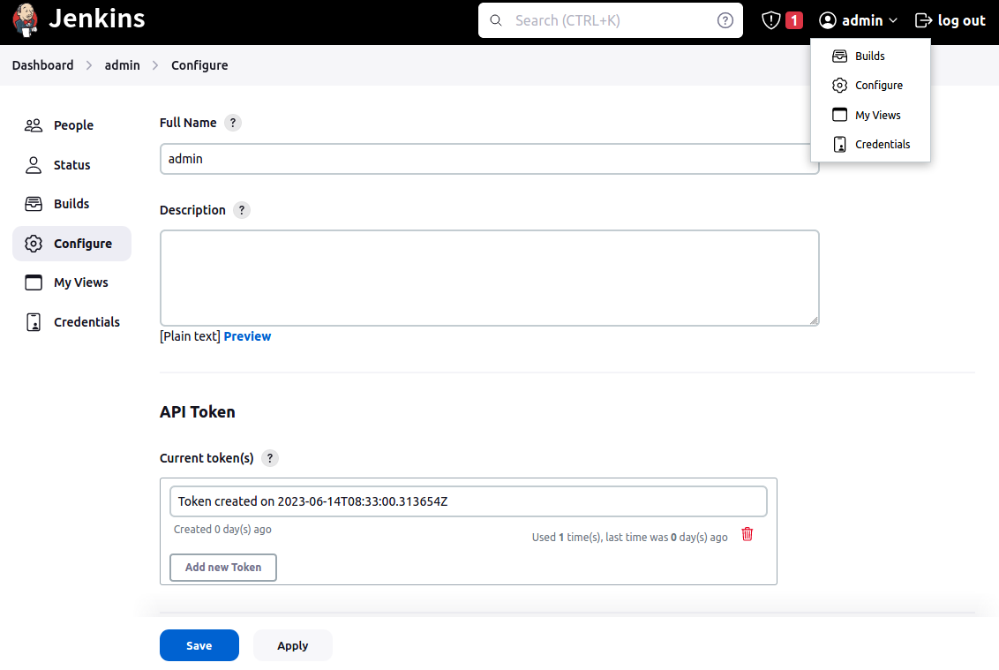

# 快速开始

## 视频介绍

<iframe src="//player.bilibili.com/player.html?aid=420715943&cid=413510859&page=1" scrolling="no" width="800px" height="600px" border="0" frameborder="no" framespacing="0" allowfullscreen="true"></iframe>

## 1. 服务集成配置

### 1.1 服务集成列表

### 1.2 新建-服务集成

#### kubernetes 配置集成

#### jenkins 配置集成

> 如何生成Jenkins API Token 参考下图

#### Registry 配置集成

::: tip

- 支持`kubernetes`、`jenkins`、`Registry` 这三种类型的配置集成；
- 必须配置至少一个`jenkins`、`Registry`, `kubernetes`类型可以根据需要添加；
- 另外 Jenkins 的 kubernetes 的授权配置请查看 [github](https://github.com/warm-native/docs/tree/master/jenkins/topic002/deploy)
- Registry 支持自建 Harbor、阿里云容器服务、腾讯云容器服务等，注意如果容器服务没有配置 https 域名的，请将“是否 HTTPS”设置为关闭状态
  :::

## 2. 创建项目

## 3. 配置项目环境/项目流程

### 3.1 新建环境

### 3.2 新建流程

### 3.3 流程配置

## 4. 应用代码配置

### 4.1 关联代码仓库

### 4.2 同步代码源

> 

::: tip

- 目前支持 `gitlab`/`github`
- 输入`仓库的主地址`/`用户名`/`Token信息`即可完成同步，为了更多的维护代码安全，这些配置信息是项目纬度的，不同项目需要独立配置．

:::

### 4.3 应用编排配置

::: tip

- 应用编排 yaml 为云原生的 kuernetes yaml 模板．

:::

## 5.创建流水线

::: tip

- 流水线创建好后，根据流水线的不同的阶段会显示允许的`操作`动作,

:::

## 6.应用服务

::: tip

- 应用服务可以查看服务状态，水平扩展，重启，删除等．

:::
