# 快速开始

## 视频介绍

<iframe src="//player.bilibili.com/player.html?aid=420715943&cid=413510859&page=1" scrolling="no" width="800px" height="600px" border="0" frameborder="no" framespacing="0" allowfullscreen="true"></iframe>

## 0.服务集成配置

### 服务集成列表

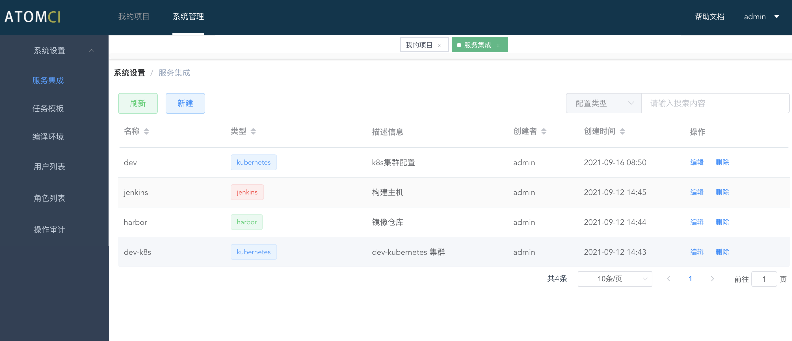

### 新建-服务集成

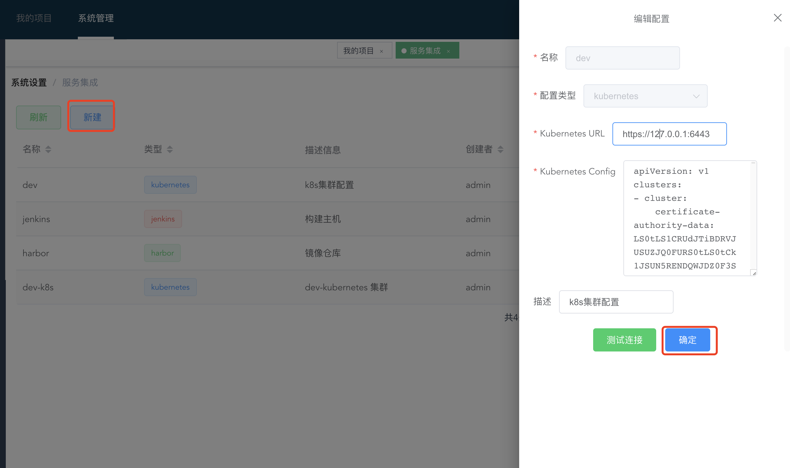

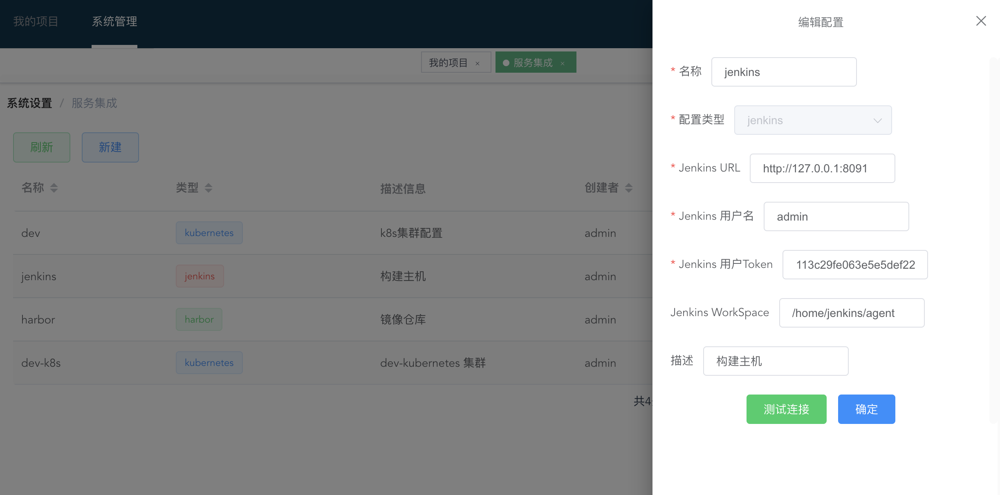

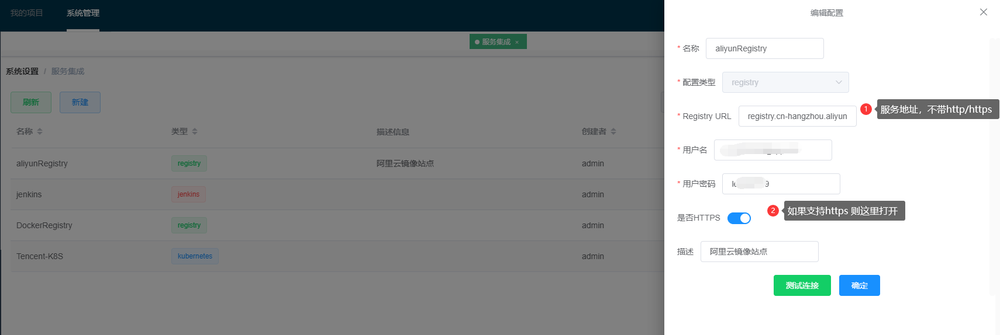

::: tip

* 支持`kubernetes`、`jenkins`、`harbor` 这三种类型的配置集成；
* 必须配置至少一个`jenkins`、`harbor`, `kubernetes`类型可以根据需要添加；
* 另外 Jenkins 的 kubernetes 的授权配置请查看 [github](https://github.com/warm-native/docs/tree/master/topic002/deploy)

:::

## 1.创建项目

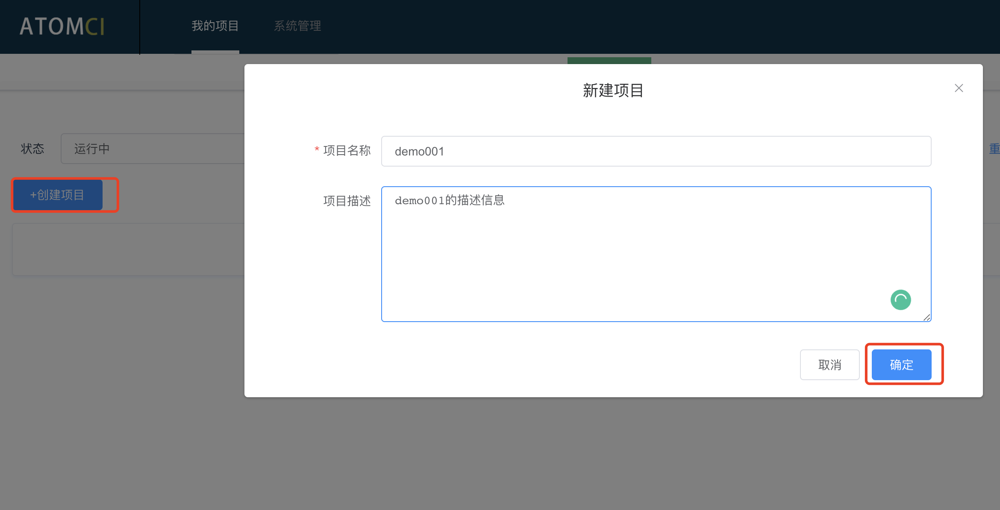

## 2.配置项目环境/项目流程

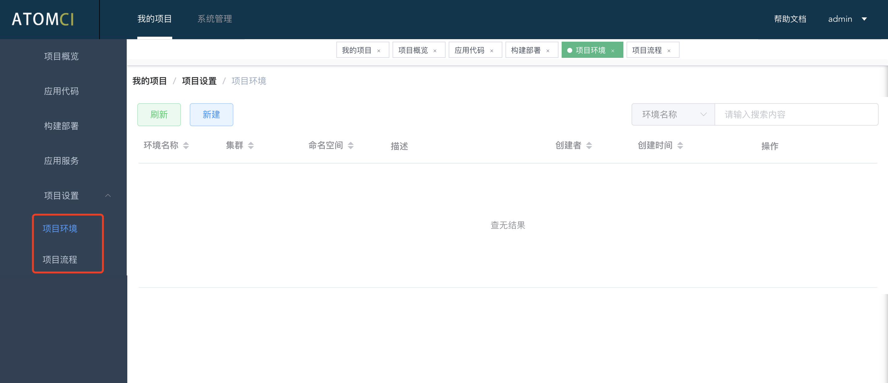

### 新建环境

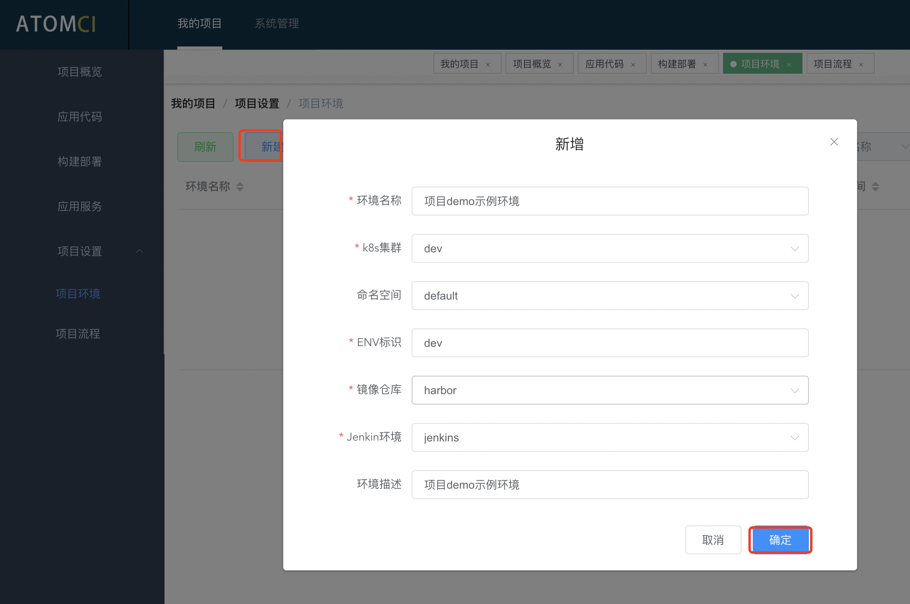

### 新建流程

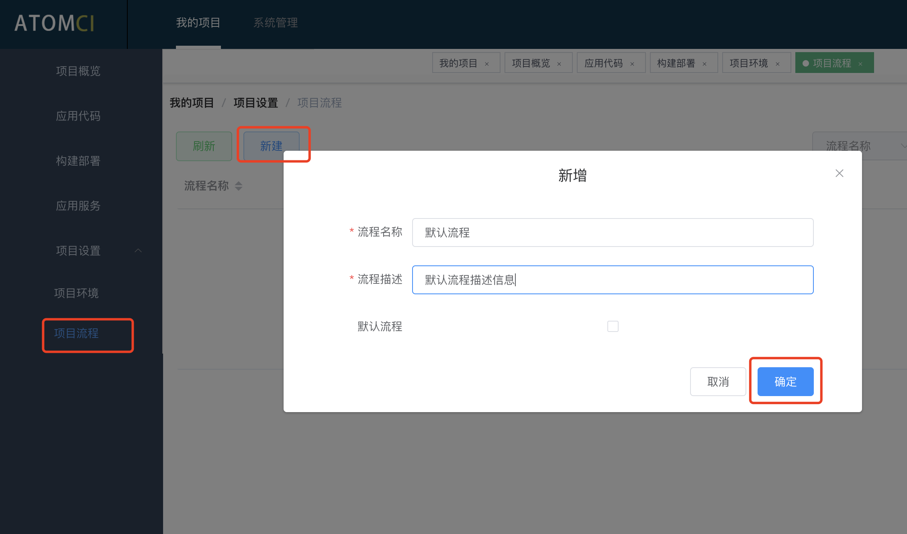
### 流程配置

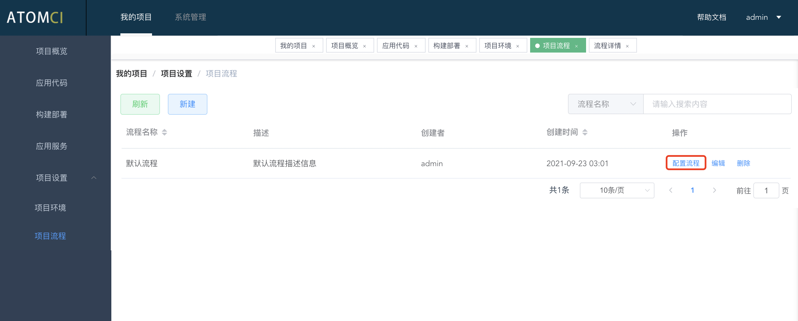

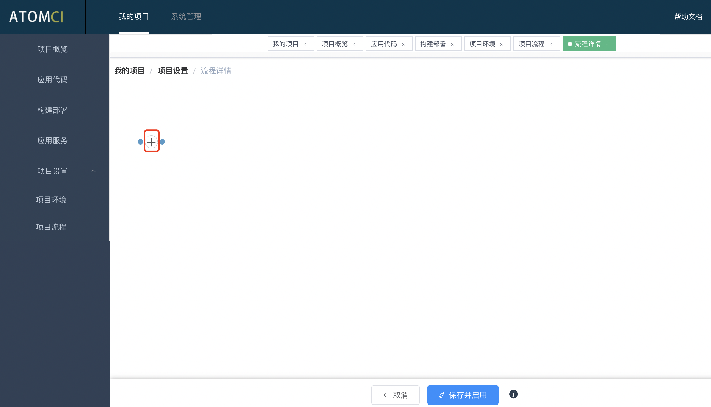

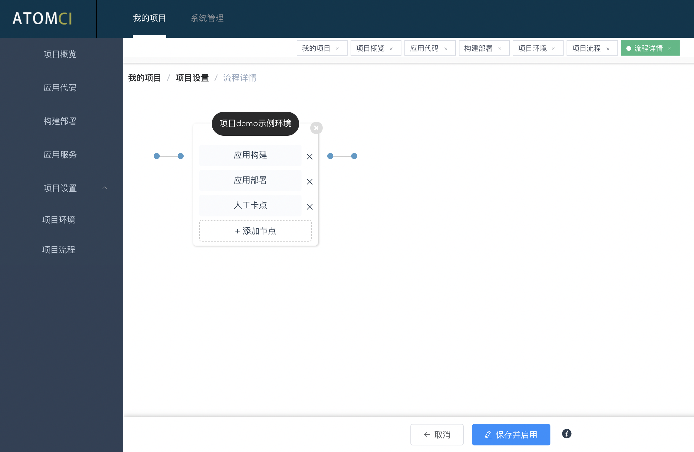
## 3.应用代码配置

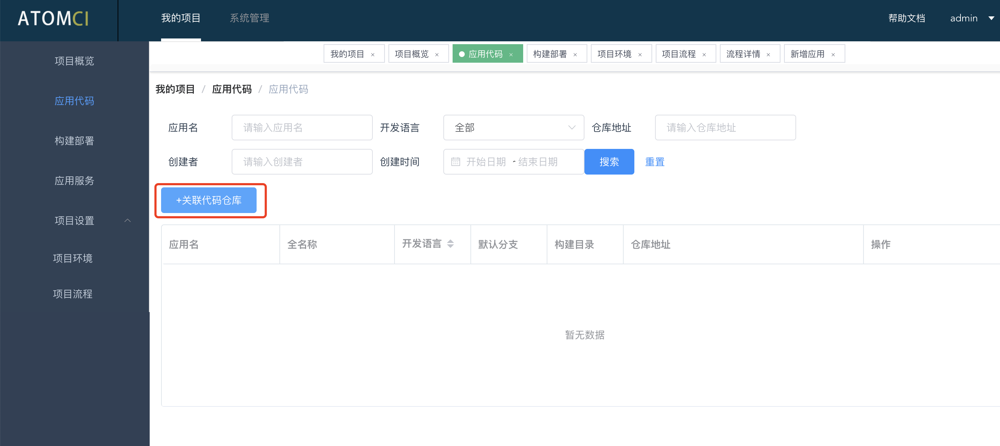

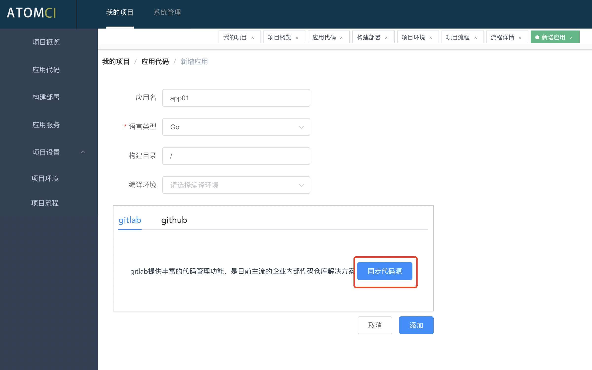

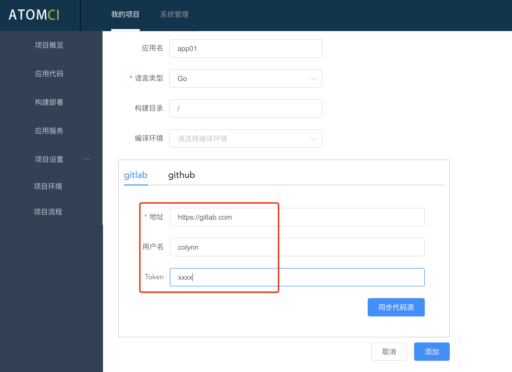

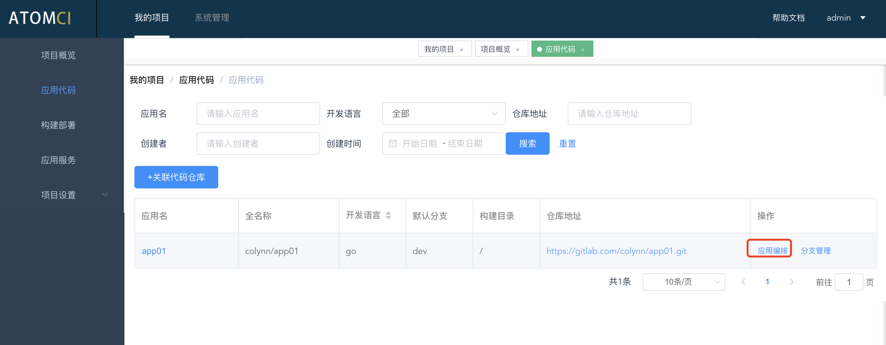

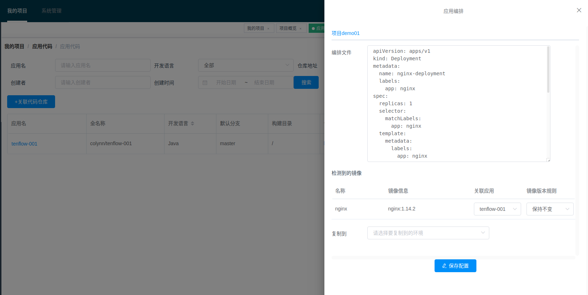
## 4.创建流水线

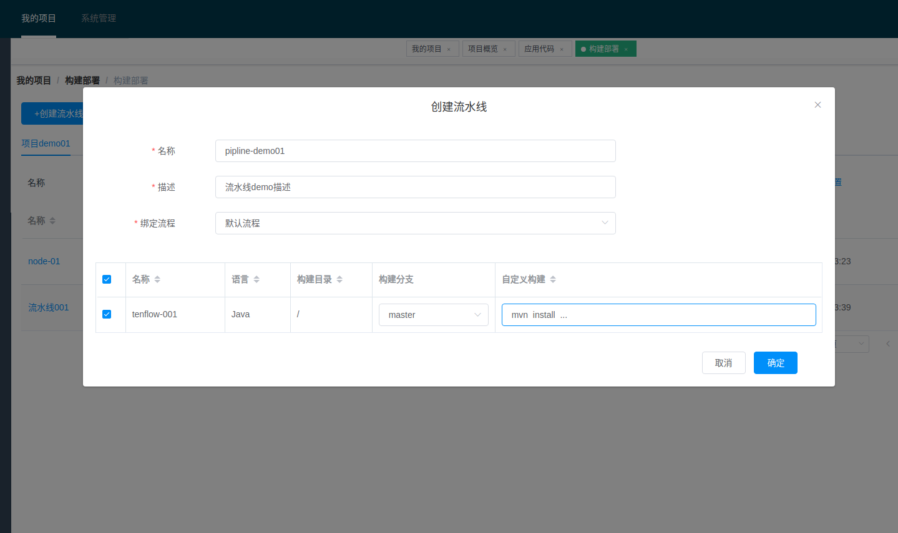

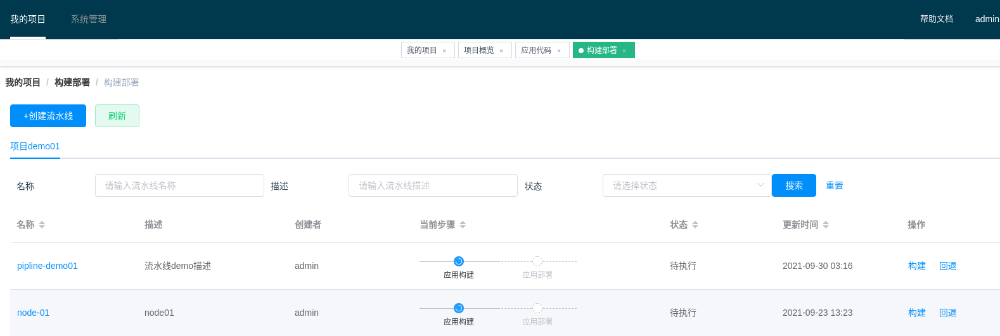

## 5.应用服务

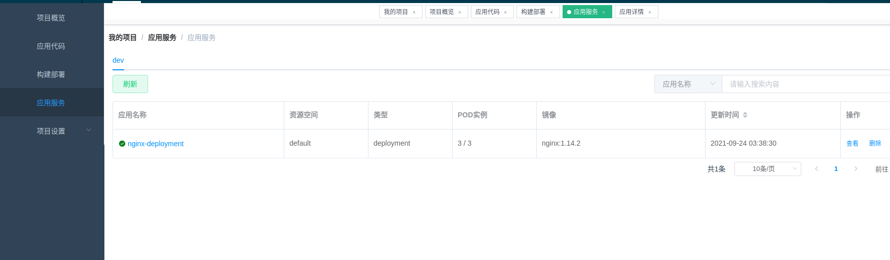