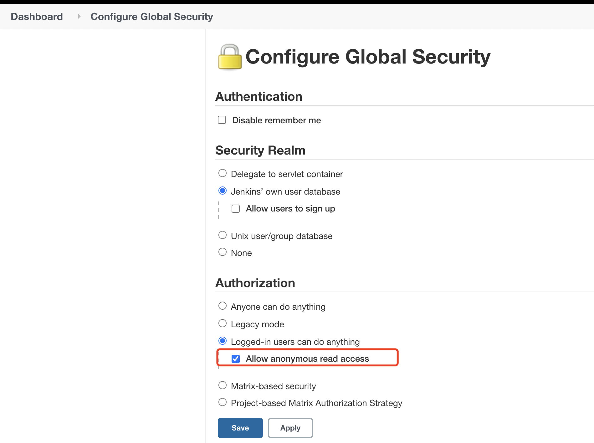
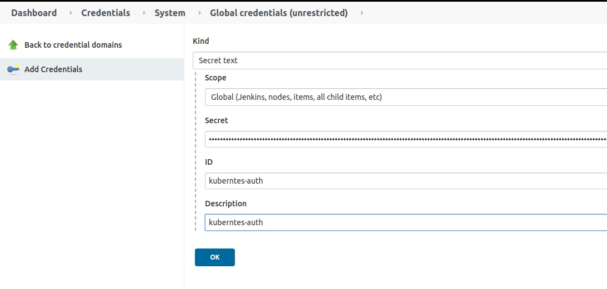
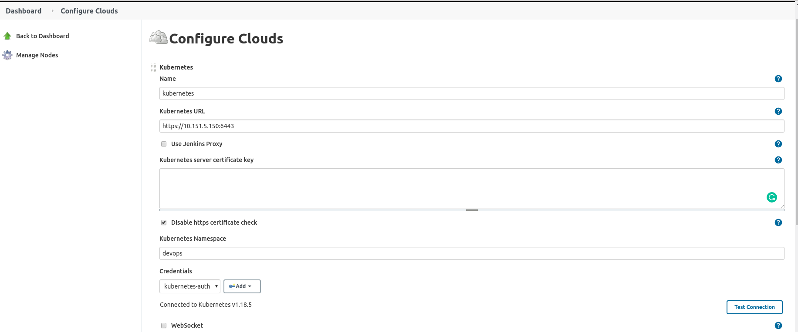

   
# Jenkins 环境配置

## 1. 确认安装依赖插件

* [kubernetes](https://plugins.jenkins.io/kubernetes)
* [Pipeline](https://plugins.jenkins.io/workflow-aggregator)
* [Blue Ocean](https://plugins.jenkins.io/blueocean)
* [HTTP Request Plugin](https://plugins.jenkins.io/http_request)

## 2. 开启匿名用户的可读权限    
> 为了保证 流水线的 日志详情可以正常打开



## 3. jenkins 正确配置kubernetes cloud

### 3.1 创建 service account

> 创建jenkins连接至kubernetes的auh信息

> 请根据`jenkins`部署在k8s的集群内或外选择[`incluster`](https://github.com/warm-native/docs/tree/master/jenkins/topic002/deploy/incluster) or [`outcluster`](https://github.com/warm-native/docs/blob/master/jenkins/topic002/deploy/outcluster)

> 注意默认授权的是`devops` 命名空间，可以根据需要修改

### 3.2 配置 Jenkins Credentials

1. 获取 service account auth信息
```sh
$ kubectl -n devops describe secrets $(kubectl -n devops describe serviceaccounts jenkins-admin  |grep "Tokens:" | awk -F':'  '{print $2}')
```

2. 创建 __Secret text__ 类型的Credentials




## 3.3. Jenkins add kubernetes cloud



__注意__: 这里使用的`Kubernetes Namespace` 注意要和创建的 service account的 namesapce一致。

## 附录
1. 详细流程请参看-[如何配置 jenkins 与 k8s 集成，bilibili 视频链接](https://www.bilibili.com/video/BV1A5411V7zm/)
